<!-- Modern GitHub Profile README for Sambit Kumar Mohanty (@Sambit-Kumar-Mohanty-26) -->
<!-- Inspired by the profile of Arun Kumar Korra -->

<!-- Header wave banner -->
<picture>
  <source media="(pre-fers-color-scheme: dark)" srcset="https://capsule-render.vercel.app/api?type=waving&height=140&color=0:0E75B6,100:6DA55F&text=Sambit%20Kumar%20Mohanty&fontColor=FFFFFF&fontSize=42&fontAlign=50&section=header&fontAlignY=35&animation=fadeIn">
  
</picture>

<div align="center">

  <!-- Animated intro -->
  

  <br/>

  <!-- Social / quick actions -->
  <a href="https://github.com/Sambit-Kumar-Mohanty-26">
    
  </a>
  
  <a href="https://www.linkedin.com/in/sambit-kumar-mohanty-36b20234a/">
    
  </a>
  <a href="https://x.com/SambitMohanty80">
    
  </a>
  <a href="mailto:sambitkumarmohanty25@gmail.com">
    
  </a>

  <br/>
  
  
  

</div>

---

<div align="center">
  <picture>
    <source media="(prefers-color-scheme: dark)" srcset="assets/profile-card-dark.svg">
    
  </picture>
</div>

---

## 👋 About Me
- 🔭 I’m **Sambit Kumar Mohanty** — a Full-Stack Developer (MERN).
- 🌱 Currently learning and exploring **AI/ML** and **Blockchain** technologies.
- ⚡ Fun fact: I debug much faster with a good cup of coffee ☕.

---

## ⚙️ Tech Stack
<!-- Grouped for clarity -->
- **Languages:**
  <div>
    
    
  </div>

- **Backend & Frameworks:**
  <div>
    
    
    
  </div>

- **Frontend:**
  <div>
    
  </div>

  - **AI/ML & Data Science:**
  <div>
    
    
  </div>

- **Databases:**
  <div>
    
  </div>

- **DevOps & Tools:**
  <div>
    
  </div>

---

## 📈 Stats & Activity

<p align="center">
  <!-- GitHub Stats -->
  <picture>
    <source media="(prefers-color-scheme: dark)" srcset="https://github-readme-stats-one-bice.vercel.app/api?username=Sambit-Kumar-Mohanty-26&show_icons=true&theme=tokyonight">
    
  </picture>
  <br/>
  <!-- Top Languages -->
  <picture>
    <source media="(prefers-color-scheme: dark)" srcset="https://github-readme-stats-one-bice.vercel.app/api/top-langs/?username=Sambit-Kumar-Mohanty-26&layout=compact&theme=tokyonight">
    
  </picture>
  <br/>
  <!-- Streak Stats (This one is working) -->
  <picture>
    <source media="(prefers-color-scheme: dark)" srcset="https://nirzak-streak-stats.vercel.app/?user=Sambit-Kumar-Mohanty-26&theme=dark&hide_border=false">
    
  </picture>
</p>

<!-- WakaTime Stats (already configured with your workflow) -->
## ⌛ WakaTime Coding Stats
<!--START_SECTION:waka-->


**🐱 My GitHub Data** 

> 📦 408.9 kB Used in GitHub's Storage 
 > 
> 🏆 1,449 Contributions in the Year 2026
 > 
> 🚫 Not Opted to Hire
 > 
> 📜 32 Public Repositories 
 > 
> 🔑 5 Private Repositories 
 > 
**I'm an Early 🐤** 

```text
🌞 Morning                768 commits         ███████░░░░░░░░░░░░░░░░░░   28.52 % 
🌆 Daytime                942 commits         █████████░░░░░░░░░░░░░░░░   34.98 % 
🌃 Evening                792 commits         ███████░░░░░░░░░░░░░░░░░░   29.41 % 
🌙 Night                  191 commits         ██░░░░░░░░░░░░░░░░░░░░░░░   07.09 % 
```
📅 **I'm Most Productive on Wednesday** 

```text
Monday                   304 commits         ███░░░░░░░░░░░░░░░░░░░░░░   11.29 % 
Tuesday                  265 commits         ██░░░░░░░░░░░░░░░░░░░░░░░   09.84 % 
Wednesday                473 commits         ████░░░░░░░░░░░░░░░░░░░░░   17.56 % 
Thursday                 363 commits         ███░░░░░░░░░░░░░░░░░░░░░░   13.48 % 
Friday                   412 commits         ████░░░░░░░░░░░░░░░░░░░░░   15.30 % 
Saturday                 421 commits         ████░░░░░░░░░░░░░░░░░░░░░   15.63 % 
Sunday                   455 commits         ████░░░░░░░░░░░░░░░░░░░░░   16.90 % 
```


📊 **This Week I Spent My Time On** 

```text
🕑︎ Time Zone: Asia/Kolkata
```

**I Mostly Code in TypeScript** 

```text
TypeScript               39 repos            ██████████████████░░░░░░░   70.91 % 
JavaScript               5 repos             ██░░░░░░░░░░░░░░░░░░░░░░░   09.09 % 
Python                   3 repos             █░░░░░░░░░░░░░░░░░░░░░░░░   05.45 % 
Ruby                     1 repo              ░░░░░░░░░░░░░░░░░░░░░░░░░   01.82 % 
C++                      1 repo              ░░░░░░░░░░░░░░░░░░░░░░░░░   01.82 % 
```


 Last Updated on 08/08/2026 06:57:19 UTC
<!--END_SECTION:waka-->

<!-- Contribution Snake (already configured with your workflow) -->
## 🐍 Contribution Graph
<picture>
  <source media="(prefers-color-scheme: dark)" srcset="https://raw.githubusercontent.com/Sambit-Kumar-Mohanty-26/Sambit-Kumar-Mohanty-26/output/github-contribution-grid-snake-dark.svg">
  
</picture>

---

<div align="center">
  <b>“Code. Create. Contribute. Repeat.”</b>
</div>

<!-- Footer wave banner -->
<picture>
  <source media="(prefers-color-scheme: dark)" srcset="https://capsule-render.vercel.app/api?type=waving&height=120&color=0:0E75B6,100:6DA55F&section=footer">
  
</picture>
